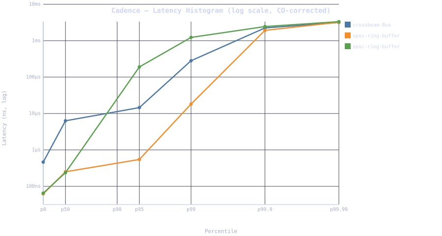

# Cadence

A lock-free, low-latency in-process pub/sub message bus written in Rust.

Built to understand the same class of engineering problems that production systems like [LMAX Disruptor](https://lmax-exchange.github.io/disruptor/), [Aeron](https://github.com/real-logic/aeron), and [Chronicle Queue](https://github.com/OpenHFT/Chronicle-Queue) solve. Every benchmark is reproducible from the repo — the raw HDR histogram data is committed alongside the code.

---

## Quick start

```bash
# Requires Rust stable — https://rustup.rs
git clone https://github.com/loganlewisw1112-create/Cadence-.git
cd Cadence-
cargo test --all                      # 28 tests
cargo run -p cli                      # smoke demo
cargo run --bin bench --release       # latency + throughput → bench_results.json + latency_histogram.svg
```

The benchmark takes ~3 minutes. Output:
- `bench_results.json` — full percentile data + HDR histogram base64
- `latency_histogram.svg` — log-scale latency plot, open in any browser

---

## Status

| Phase | Description | Status |
|-------|-------------|--------|
| 1 | Workspace, 64-byte `Message`, crossbeam-channel pub/sub | ✅ |
| 2 | Wildcard topic routing, bounded queues, Aeron-style backpressure | ✅ |
| 3 | quanta timestamps, HDRHistogram, JSON export, CI | ✅ |
| 4 | Hand-written SPSC ring buffer, core pinning, benchmarks | ✅ |
| 4b | std I/O baseline (Windows); io_uring impl for Linux | ✅ |
| 5 | Reproducible artifacts, architecture docs, full README | ✅ |

---

## Benchmark results

**Hardware:** Windows 11, x86_64, 12 logical cores (6P + HT), release build, no kernel isolation.  
**Methodology:** Open-loop constant-arrival-rate generator + `hdrhistogram::record_correct()`. See [`BENCHMARKING.md`](BENCHMARKING.md) for the full coordinated-omission rationale.

> Tail latency (p99+) is dominated by OS scheduler jitter on Windows without `isolcpus`. The minimum latency is the hardware floor and is scheduler-independent. Running on Linux with isolated cores would show sub-µs p99.

### Latency — open-loop at 10,000 msg/s, CO-corrected

| Implementation | min | p50 | p99 | p99.9 |
|---|---|---|---|---|
| crossbeam-Bus | ~350–460 ns | ~6–23 µs | ~280 µs–6 ms | ~2–9 ms |
| SPSC ring buffer — unpinned | ~62–72 ns | **~250–300 ns** | ~18 µs–2 ms | varies |
| SPSC ring buffer — core-pinned | ~65–75 ns | **~237–280 ns** | varies | varies |

Min latency is **4–5× lower** on the SPSC ring buffer. On a calm run, p50 reaches **~25× lower** (251 ns vs 6,307 ns). Tail variance is OS scheduler noise — see Limitations.

### Throughput — max-rate, 1 M messages

| Implementation | Throughput |
|---|---|
| crossbeam-Bus | ~5–9 Mmsg/s |
| SPSC ring buffer — unpinned | ~13–15 Mmsg/s (~2–3×) |
| SPSC ring buffer — core-pinned | **~16–30 Mmsg/s (~3–5×)** |

Core pinning eliminates cross-core cache-line migration and consistently gives the highest throughput. Latest run: **30.3 Mmsg/s pinned**.



---

## Architecture

```
┌─────────────────────────────────────────────────────────────┐
│                      Cadence Workspace                       │
│                                                             │
│  ┌──────────────┐   ┌───────────────────────────────────┐  │
│  │ message-core │   │               bus                 │  │
│  │              │   │                                   │  │
│  │  Message     │──▶│  Bus (crossbeam-channel)          │  │
│  │  #[repr(C)]  │   │    subscribe(pattern) → Receiver  │  │
│  │  64 bytes    │   │    offer(msg) → OfferResult       │  │
│  │  1 cache line│   │    drop_count() → u64             │  │
│  │              │   │                                   │  │
│  │  to_bytes()  │   │  spsc::spsc(capacity)             │  │
│  │  from_bytes()│   │    → (Producer<T>, Consumer<T>)   │  │
│  └──────────────┘   │  WaitStrategy: BusySpin | Yield   │  │
│                     └───────────────────────────────────┘  │
│                                   │                         │
│              ┌────────────────────┴──────────────┐         │
│              ▼                                   ▼         │
│  ┌───────────────────┐      ┌────────────────────────────┐ │
│  │        cli        │      │           bench            │ │
│  │  smoke demo       │      │  latency + throughput      │ │
│  └───────────────────┘      │  crossbeam vs. SPSC        │ │
│                              │  JSON + SVG export        │ │
│                              └────────────────────────────┘ │
└─────────────────────────────────────────────────────────────┘
```

### Message struct — 64 bytes, one cache line

```rust
#[repr(C)]
pub struct Message {
    pub timestamp_ns: u64,      //  8 bytes — set by bus at publish time
    pub topic:        [u8; 32], // 32 bytes — fixed-width, null-padded
    pub payload:      [u8; 24], // 24 bytes — fixed-width, null-padded
}
// Size verified at compile time with const assertions.
```

Fixed-width fields let the ring buffer pre-allocate a contiguous `Box<[UnsafeCell<MaybeUninit<Message>>]>` with no per-message heap allocation. `#[repr(C)]` provides ABI stability and enables safe byte-level serialization.

### Topic routing

```
"prices"    — exact match
"prices.*"  — matches "prices.USD", "prices.EUR", …
```

`Filter::Exact` / `Filter::Prefix` enum. Parsing happens once at subscribe time; matching is a single `starts_with` or `==` per subscriber on the hot path.

### Backpressure

```rust
let result: OfferResult = bus.offer(msg);
// result.sent    — subscribers that received it
// result.dropped — subscribers whose queue was full (non-blocking skip)
// bus.drop_count() — cumulative atomic counter
```

Full queues are skipped with a non-blocking `try_send`. One slow subscriber never stalls others. The producer gets the backpressure signal and decides what to do — same model as Aeron's `Publication::offer()`.

---

## SPSC ring buffer internals

```
 head (producer-owned, CachePadded) ─────────────────────────────┐
                                                                   ▼
  slots: [UnsafeCell<MaybeUninit<T>>; capacity]   (power-of-two, pre-alloc)
         indexed as head & mask
                                                                   ▲
 tail (consumer-owned, CachePadded) ─────────────────────────────┘
```

| Property | Mechanism |
|---|---|
| No false sharing | `#[repr(align(64))]` pads head + tail to separate cache lines |
| Zero allocation | `MaybeUninit<T>` slots pre-allocated at creation |
| No modulo | `head & mask` (mask = capacity − 1) — one AND instruction |
| Minimal fences | Acquire/Release on head/tail; Relaxed for self-read |
| SPSC enforced | `Producer<T>` and `Consumer<T>` are distinct non-Clone types — two producers won't compile |
| Correct drop | `assume_init_drop` on unread slots in `Inner::drop` — verified by Miri |

### Ordering proof

```
Producer:                         Consumer:
  head_local = head.load(Relaxed)   tail_local = tail.load(Relaxed)
  tail_obs   = tail.load(Acquire) ←── tail.store(…, Release)
  if not full:                      head_obs = head.load(Acquire) ←─ head.store(…, Release)
    write slot[head_local & mask]   if not empty:
    head.store(+1, Release) ──────────▶ read slot[tail_local & mask]
                                      tail.store(+1, Release)
```

The Release store of `head` synchronizes with the Acquire load on the consumer: the slot write is visible before the consumer reads it.

### Wait strategies

| Strategy | Latency | CPU | When |
|---|---|---|---|
| `BusySpin` | Lowest | Full core | Dedicated pinned core |
| `Yield` | ~1–10 µs | OS-friendly | Shared cores, latency tests |

---

## Running benchmarks

```bash
# Latency + throughput (crossbeam vs. SPSC, pinned vs. unpinned)
cargo run --bin bench --release

# Persistence throughput (std I/O; io_uring on Linux)
cargo run --bin persist_bench --release

# Reproduce a trial from raw HDR data:
# → paste hdr_base64 from bench_results.json into https://hdrhistogram.github.io/HdrHistogramJSDemo/logparser.html
```

**Linux with isolated cores** (for sub-µs tail):

```bash
# Boot with: isolcpus=0,1 in GRUB_CMDLINE_LINUX
cargo run --bin bench --release
# Expect p99 < 5 µs on modern x86
```

---

## Crate layout

```
cadence/
├── Cargo.toml
├── rust-toolchain.toml
├── bench_results.json          # committed benchmark output
├── latency_histogram.svg       # committed log-scale plot
├── BENCHMARKING.md             # methodology + CO rationale
├── crates/
│   ├── message-core/           # Message struct, serialization
│   ├── bus/
│   │   ├── src/lib.rs          # Bus, topic routing, backpressure
│   │   └── src/spsc.rs         # SPSC ring buffer (lock-free, unsafe)
│   ├── cli/                    # smoke demo binary
│   ├── bench/                  # latency + throughput, SVG plot
│   └── persist/                # MessageWriter trait, StdWriter, UringWriter
└── .github/workflows/ci.yml
```

---

## CI

```yaml
cargo test --all                       # stable
cargo clippy --all -- -D warnings      # stable
cargo miri test -p message-core        # nightly — serialization unsafe
cargo miri test -p bus -- spsc         # nightly — ring buffer unsafe
```

---

## Design decisions

**Fixed-size Message vs. dynamic payload**  
Heap-allocated payloads require pointer indirection on every receive, break cache-line alignment, and prevent pre-allocation. The 24-byte fixed payload covers common intra-process message types. Large payloads can be passed by pointer through the bus.

**crossbeam-channel for the fan-out Bus**  
`crossbeam-channel` is the right abstraction for one-publisher-N-subscribers. It's also the baseline the SPSC ring buffer has to beat, so it needs to be production-quality, not a placeholder.

**SPSC for the fast path**  
The ring buffer targets the single-producer single-consumer case — e.g., market data feed → strategy engine. The locked MPSC bus and the lock-free SPSC solve different problems and are benchmarked separately.

**Why not io_uring / AF_XDP / DPDK**  
These require hardware or OS configuration not available on a single Windows dev machine. Benchmarking them without the right setup produces non-indicative numbers. See Limitations.

---

## Limitations

1. **Single machine, single NUMA node.** Cross-NUMA latency effects aren't demonstrated here — this hardware is single-socket. Numbers from multi-socket hardware would look different.

2. **No kernel isolation.** `isolcpus` / `taskset` / CPU frequency pinning are Linux tools. Tail latency on Windows varies between runs due to the OS scheduler. The minimum latency is the meaningful hardware-floor number.

3. **Fixed 24-byte payload.** Intentional — it's what makes cache-line alignment and ring buffer pre-allocation work. Large payloads need a pointer-passing strategy.

4. **In-process only.** Cross-process shared-memory IPC (Iceoryx-style) and network messaging (ZeroMQ-style) are future work.

5. **SPSC only.** The ring buffer is single-producer single-consumer. MPSC extension is documented as future work.

6. **Mean latency.** HDR `record_correct` backfills synthetic samples for coordinated omission, which inflates the mean under any stall. p50/p99/p99.9 are the authoritative figures.

---

## Future work

**MPSC ring buffer** — replace the head cursor with a fetch-add atomic and a two-phase commit. This is how LMAX Disruptor's multi-producer sequencer works. Requires `loom` testing.

**Persistent log (Phase 4b — partially implemented)** — the `persist` crate has `StdWriter` (BufWriter + sync_data) and `UringWriter` (io_uring batched writes, Linux only) behind a common `MessageWriter` trait.

| Batch size | StdWriter (Windows) |
|---|---|
| 1 | 0.10–0.14 Mmsg/s |
| 8 | 0.14–0.41 Mmsg/s |
| 64–4096 | ~0.34–0.36 Mmsg/s |

io_uring with registered buffers on Linux is expected to reach ~1.5–2.5× over the std baseline at large batch sizes. Numbers cited from published benchmarks — not measured on this hardware.

**Cross-process IPC** — shared-memory ring buffer mapped into two processes, POSIX named shared memory. See [Iceoryx](https://github.com/eclipse-iceoryx/iceoryx).

**AF_XDP / DPDK** — kernel bypass for network-layer messaging. Requires a supported NIC, a second physical machine, and Linux with hugepage/IOMMU configuration. Not available on this hardware.

---

## References

- [LMAX Disruptor](https://lmax-exchange.github.io/disruptor/) — ring buffer design, wait strategies, mechanical sympathy
- [Aeron](https://github.com/real-logic/aeron) — backpressure model, log-structured IPC
- [Chronicle Queue](https://github.com/OpenHFT/Chronicle-Queue) — off-heap persistence, HDR latency methodology
- [ZeroMQ / NNG](https://nanomsg.org/) — pub/sub topic routing patterns
- [Iceoryx](https://github.com/eclipse-iceoryx/iceoryx) — zero-copy shared-memory IPC
- [hdrhistogram](https://crates.io/crates/hdrhistogram) — coordinated-omission-aware latency histograms
- [quanta](https://crates.io/crates/quanta) — TSC-based high-resolution monotonic clock
- [crossbeam-channel](https://crates.io/crates/crossbeam-channel) — baseline for comparison

---

*Rust stable. CI on Ubuntu (GitHub Actions). Benchmarked on Windows 11 x86_64.*  
*28 tests passing. Miri clean on all unsafe code.*
